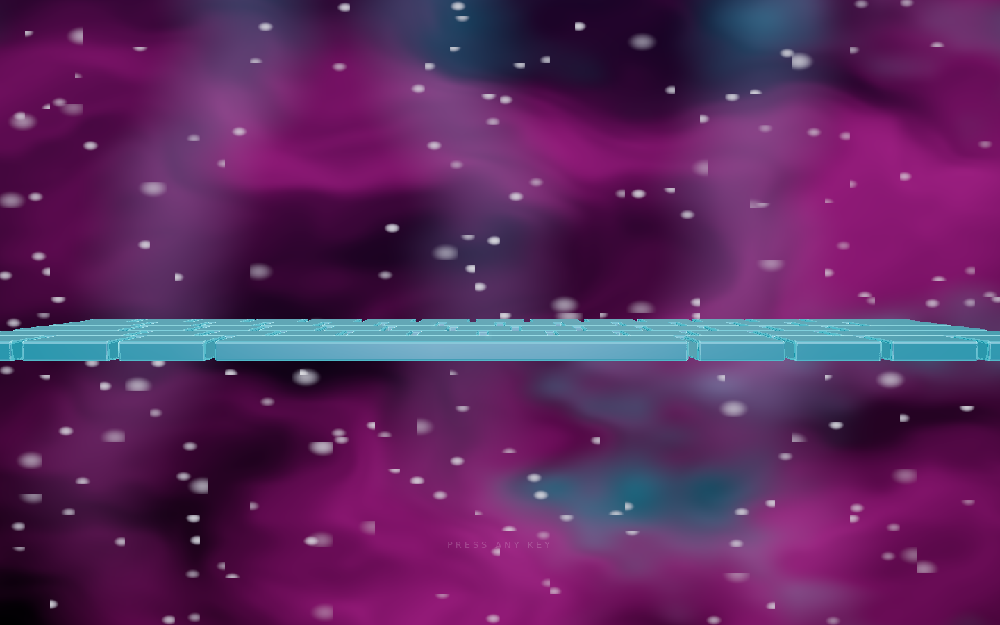

# keyboard visualizer

A seed-driven generative instrument — every keystroke is light and sound.

**Deployed URL:** _not yet deployed — see [Deployment](#deployment) below._



## How it works

There is exactly **one** source of truth per style: a `Style` object, a flat record of
~45 numeric "dials" plus a 6-stop OKLCH palette and a musical scale. A seed (a `uint32`
carried in the URL as `?s=<base36>`) is expanded by a seeded `sfc32` PRNG into
`StyleParams` — a primary anchor, a secondary anchor, a blend factor `t`, and a jitter
vector — which `composeStyle()` turns into a `Style`. Everything you see and hear —
the background shader, the keyboard's materials, the particle system, the synthesizer,
the camera drift — is a pure function of the *current* `Style`, re-read every frame.

Five named themes (Mountains, Ice, Ocean, Space, Desert) are just pinned seeds `1..5` in
this same space — `t = 0`, zero jitter, nothing special about them structurally. The
randomizer samples new points in the same space. There is no separate "preset" code path:
naming a theme and rolling the dice both call `composeStyle()`.

Sound and visuals are never independently authored: the same `Style` that sets a key's
roughness and emissive color also sets the synth voice's oscillator mix, filter cutoff,
and reverb send. Change the seed and the whole instrument — light, motion, and tone —
moves together.

## The dials

The full dial table (name, range, jitter fraction, and each anchor's value) lives in
[`src/style/dials.ts`](src/style/dials.ts) — that file is the source of truth, not this
README. Palettes and scales for the five anchors are in
[`src/style/anchors.ts`](src/style/anchors.ts).

## Controls

| Input | Effect |
|---|---|
| Type on your keyboard | Every key is a note and a light — press to play |
| `F1`–`F5` | Jump to a named theme (Mountains, Ice, Ocean, Space, Desert) |
| `F6` | Randomize — morph to a new seed |
| `F7` or click the seed chip | Copy the current `?s=` link to your clipboard |
| Click a theme dot | Jump to that theme |
| Click the dice | Randomize |
| `?s=<seed>` in the URL | Load a specific style directly |

## Running locally

```sh
npm i
npm run dev
```

Build for production:

```sh
npm run build
```

Run the test suite:

```sh
npm run test
```

## Tech notes

- **Vite + TypeScript (strict) + Three.js.** No UI framework — the DOM chrome is a
  handful of elements manipulated directly.
- **Custom GLSL.** The background (terrain, aurora, caustics, nebula, stars, mist,
  shimmer) and the particle system are hand-written shaders, composited by uniform
  weight so every theme shares one shader.
- **Hand-written OKLCH pipeline.** Color blending happens in OKLCH (shortest-hue-arc
  lerp) and is only converted to linear sRGB at the last step, with chroma-reduction
  gamut clamping. No `culori` dependency.
- **Web Audio synthesis, no samples.** Every note is three morphing oscillators + an FM
  partial + filtered noise, shaped by an ADSR-ish envelope and sent through a
  procedurally generated convolution reverb and a filtered delay.
- **Seeded `sfc32`/`splitmix32`.** `Math.random()` is never called anywhere in `src/`
  (enforced by an ESLint rule) — every random draw, from style jitter to particle
  spawn direction, comes from a seeded stream so a given `?s=` link always reproduces
  the exact same instrument.
- **`prefers-reduced-motion` support.** Camera drift, particle trail/speed/count,
  screen shimmer, and ghost ripples all back off when the OS setting is on, live —
  no reload required.

## Deployment

1. Push this repo to GitHub (public), default branch `main`.
2. On [vercel.com](https://vercel.com), **Add New Project** → import the repo. The Vite
   preset is auto-detected (build `npm run build`, output `dist`) — accept the defaults,
   no environment variables or `vercel.json` needed.
3. Verify the production URL: `/?s=2` should reproduce Ice, and sound should play after
   the first keypress.
4. Subsequent pushes to `main` auto-deploy; PR branches get preview URLs.

## License

MIT — see [LICENSE](LICENSE).
